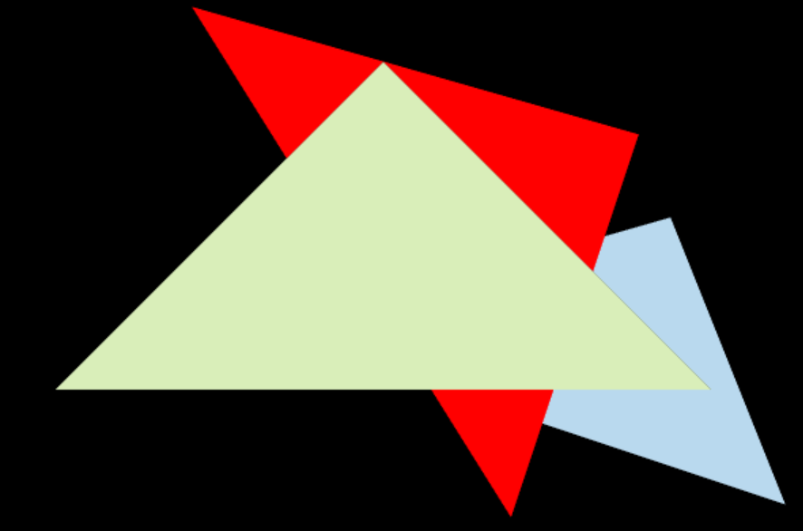
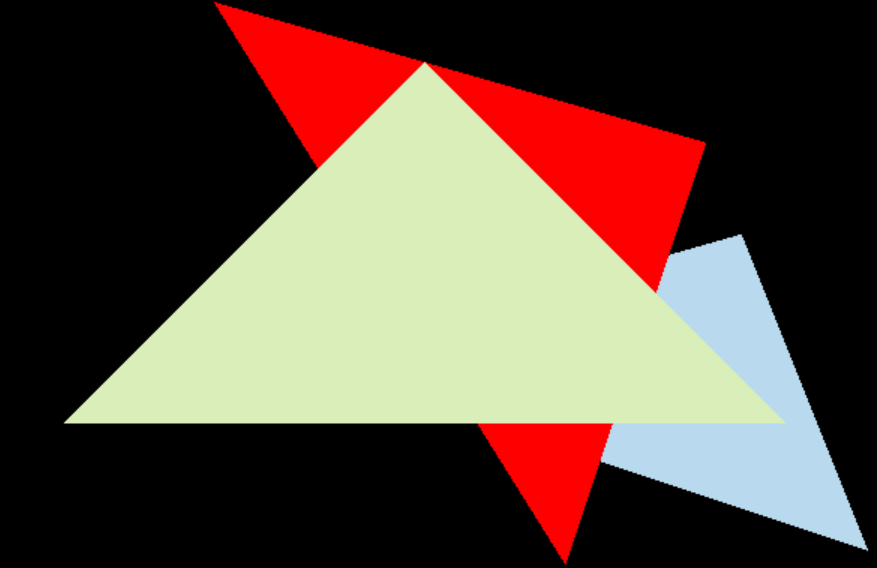

作业2经历了相当长的一段debug阶段= =

主要了解了三角形绘制（叉乘判断）、SSAA、MSAA

为了效果与pdf预览一致，需要把作业一中对于翻转的处理添加进来

作业参考[GAMES101-现代计算机图形学-闫令琪 作业2 反走样 antialiasing 抗锯齿_4396！的博客-CSDN博客](https://blog.csdn.net/weixin_51928794/article/details/117256226)

三角形绘制没什么好记的 主要讲讲SSAA和MSAA

SSAA-他真的很需要显存：

在原来的绘制中，即在width*height的屏幕中考虑点是否在三角形内部中即可

对于SSAA，需要width * 采样率 * height * 采样率大小的深度缓存和颜色缓存，例如作业里一样采样率为2的话，也需要额外4倍大小float（储存深度）和4倍大小vector3（储存颜色）

都采样存起来之后 再绘制的时候把2*2的附近采样点累加/4就好了

显存用得多 但SSAA效果那确实好


MSAA-有舍有得：

SSAA用了太多显存了 那MSAA就是要相对的砍一些显存 尽量达到差不多的效果

对于MSAA的采样储存，不选择先采样存储后平均计算，而是在对三角形进行渲染时直接计算，放弃了对于颜色的储存，理论上需要2*2大小的深度储存来达到较好的效果，如果对于深度缓存直接计算存储的话会导致黑边。

黑边问题：如果直接计算单个三角形周围的采样点的话，对于z较小（即较前的三角形），若在4*4的采样区域内只有1块像素区域有效，则插值的结果会导致颜色变为1/4，表现结果像是黑色

解决方法：用2*2额外采样深度空间来存储颜色情况

个人改进：

不额外存储深度空间，而是额外存储一个颜色覆盖比例（对于每个width*height格子，存储在这个格子中最前方（最靠近摄像机视角）的三角形的的颜色覆盖比例（通过采样））

然后利用存储的颜色覆盖比例来计算混合的颜色

这样空间相比2*2的深度存储空间而言进一步优化 效果也还不错

```
if (z_interpolated < depth_buf[index]) {
                Eigen::Vector3f p;
                p << i, j, z_interpolated;
                Eigen::Vector3f color = t.getColor() * (count / max_count) + (1 - count / max_count) * frame_buf[index];
                if (count != max_count) {
                    msaa_check_edge[index] = count / max_count;
                }
                set_pixel(p, color);
                depth_buf[index] = z_interpolated;
            }
            else {
                if (msaa_check_edge[index] != 1) {
                    Eigen::Vector3f color = t.getColor() * (1 - msaa_check_edge[index]) + frame_buf[index] * msaa_check_edge[index];
                    Eigen::Vector3f p;
                    p << i, j, z_interpolated;
                    set_pixel(p, color);
                }
            }
```

主要颜色计算思路：新颜色=z最小颜色 * z最小颜色的覆盖比例 + 其他颜色 * (1 - z最小颜色的覆盖比例)

效果如下



跟ssaa相比会有一点灰边 但我觉得是不影响观感的

然后是NAA（无抗锯齿）的效果图



明显能从三角形的周围看到锯齿
