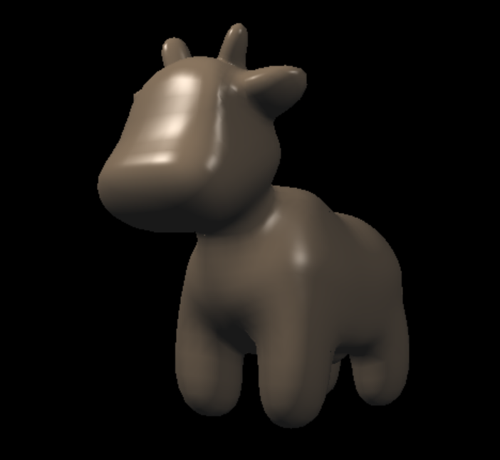
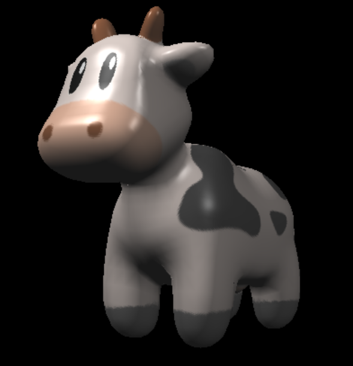
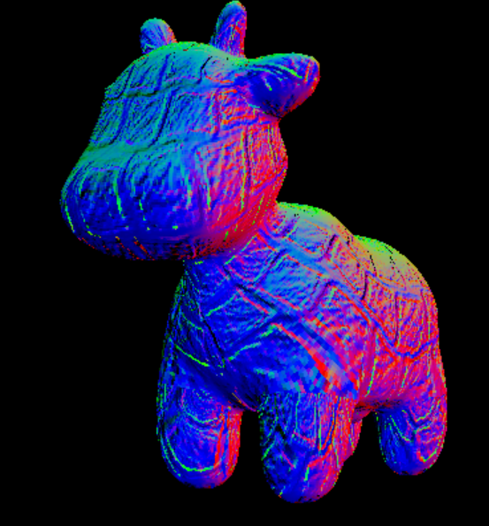
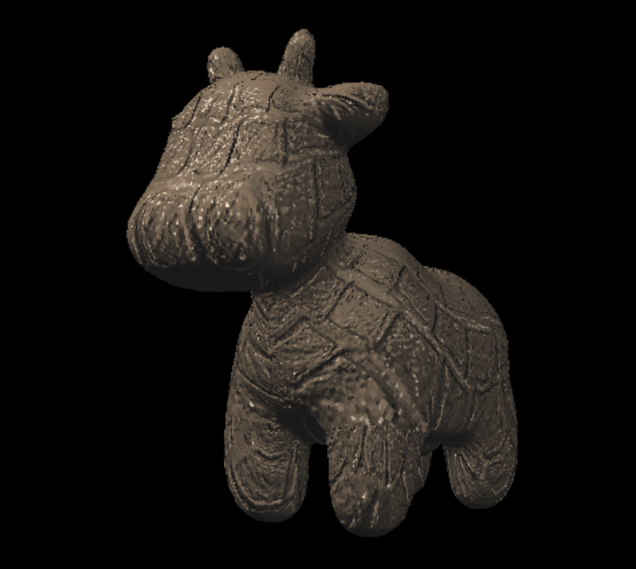
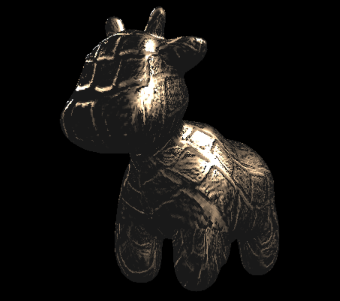

牛牛斯巴拉西！

一开始的颜色、法向量、纹理颜色、内部点颜色插值有点懵，以为要自己算，后来发现给了interpolate函数 = =

```
// 颜色插值
auto interpolated_color = interpolate(alpha, beta, gamma, t.color[0], t.color[1], t.color[2], 1);
// 法向量插值
auto interpolated_normal = interpolate(alpha, beta, gamma, t.normal[0], t.normal[1], t.normal[2], 1);
// 纹理坐标插值
auto interpolated_texcoords = interpolate(alpha, beta, gamma, t.tex_coords[0], t.tex_coords[1], t.tex_coords[2], 1);
/ 内部点位置插值
auto interpolated_shadingcoords = interpolate(alpha, beta, gamma, view_pos[0], view_pos[1], view_pos[2], 1);
```

然后就是喜闻乐见的简单布林冯模型

```
Light_diffuse = kd.cwiseProduct(light.intensity / r.dot(r)) * MAX(0.0f, normal.normalized().dot(r.normalized()));
Light_specular = ks.cwiseProduct(light.intensity / r.dot(r)) * pow(MAX(0.0f, normal.normalized().dot(h.normalized())), p);
Light_ambient = ka.cwiseProduct(amb_light_intensity);
```

效果图如下，因为没有使用纹理的颜色所以颜色都一样，只呈现了光效的效果



然后就是在布林冯的基础上把颜色从纹理图里获取，这里也给了函数，就是根据纹理坐标获取纹理颜色= =

```
if (payload.texture)
{
	return_color = payload.texture->getColor(payload.tex_coords.x(), payload.tex_coords.y());
}
```

效果图如下 有了个好看的牛牛



对于bump和displacement：

这一块不太懂 不管是代码上还是原理上= =

对于bump，从纹理图计算新的normal，更改反射光法线

对于displacement，在normal的基础上进一步计算新的view_pos

效果图

bump的矢量图



上图材质图的bump结果

可以看到该效果与直接的blingphong模型光照关系相差不大，但由于光线的法线不同，可以看到牛上的不同凹凸效果



上图材质图的displacement结果

可以看出在displacement的view_pos进一步变化下，打光效果不同，对于材质图的高度变化在渲染中直接显示为模型的变更，光照效果相差较大，而不是直接在相同的光照基础上更改凹凸效果。

