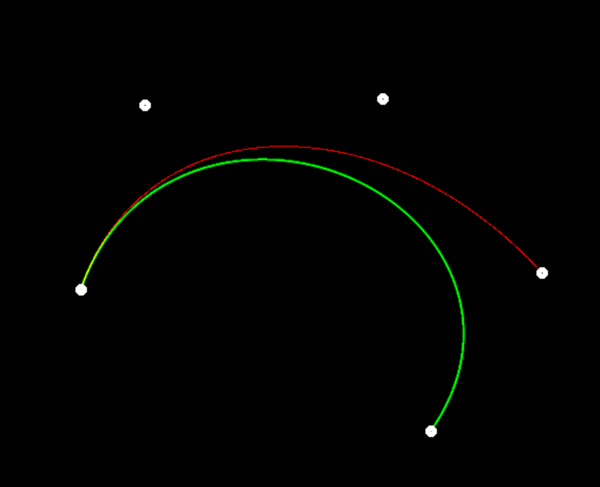

贝塞尔曲线 很简单 没啥好说的

直接上代码

核心绘制算法

```cpp
for (double t = 0.0; t <= 1.0; t += 0.0001)
    for (int i = 0; i < control_points.size(); i++) {
        result_point += control_points[i] * c(i, control_points.size() - 1) * pow(1 - t, control_points.size() - 1 - i) * pow(t, i);
    }
}
```

第一层循环t越小则贝塞尔绘制精度越高，第二层贝塞尔曲线绘制位置由控制点决定。

改进绘制算法-增加抗锯齿：

```
const float x[4] = { 0,0,1,-1};
const float y[4] = { +1,-1,0,0 };
int xnow = round(result_point.x), ynow = round(result_point.y);
float d = std::sqrt(std::pow(result_point.x - xnow, 2) + std::pow(result_point.y - ynow, 2));
for (int i = 0; i < 4; i++) {
	float x_neibor = floor(result_point.x + x[i]);
	float y_neibor = floor(result_point.y + y[i]);
	if (x_neibor >= 0 && x_neibor < 700 && y_neibor >= 0 && y_neibor < 700) {
		float w = d / std::sqrt((std::pow(x_neibor - result_point.x, 2) + std::pow(y_neibor - result_point.y, 2)));
		window.at<cv::Vec3b>(y_neibor, x_neibor)[1] = std::max(float(window.at<cv::Vec3b>(y_neibor, x_neibor)[1]), 255 * w);
	}
}
```

计算公式：d为当前绘制点理论坐标与目标绘制点的距离，w为该距离/周围各点到该理论点的距离，将该权重乘上颜色使得周围像素颜色变淡从而实现抗锯齿，在绘制时需要注意与原颜色匹配，注意不要将已绘制的最大颜色覆盖。

效果

原框架只能实现4点的贝塞尔曲线绘制

改进后算法实现任意点绘制，且优化锯齿效果

