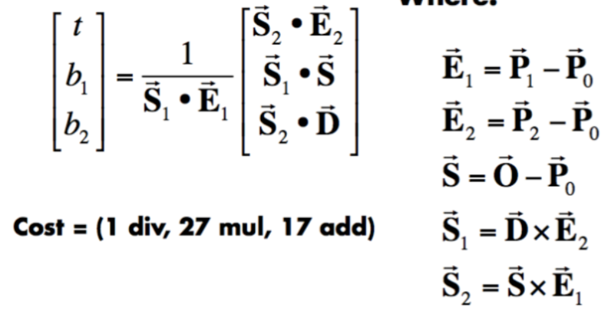
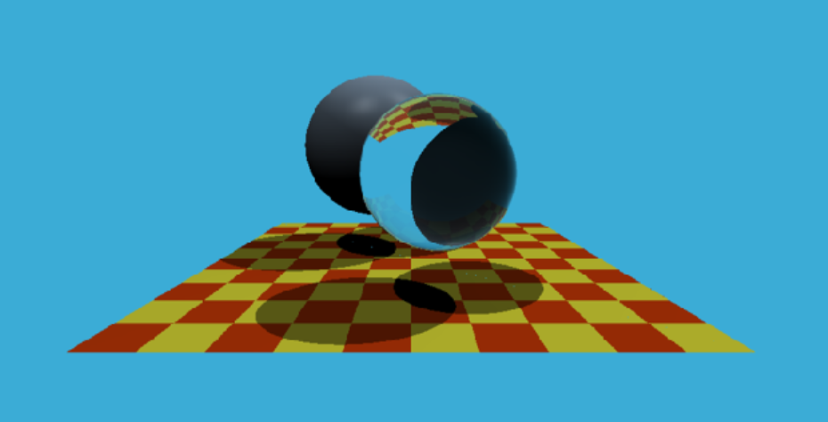

该次作业需要更改两个函数

Render.cpp中的Render()函数

要求：根据摄像机方向和aspect_radio等来确定投射光线的方向

```
for (int j = 0; j < scene.height; ++j){
	for (int i = 0; i < scene.width; ++i){
        float x = 1;
        float y = 1;         
        x = (((float)i + 0.5) / scene.width * 2 - 1) * scale * imageAspectRatio;
        y = -(((float)j + 0.5) / scene.height * 2 - 1) * scale;

        Vector3f dir = Vector3f(x, y, -1); // Don't forget to normalize this direction!
        dir = normalize(dir);
        framebuffer[m++] = castRay(eye_pos, dir, scene, 0);
    }
}
```

遍历屏幕上每个像素点，根据像素点位置变换为投影矩阵的光线方向

Triangle.hpp中的rayTriangleIntersect()函数

判断投射光线和空间中的三角形是否相交，用课上的公式



代码实现如下

```
Vector3f e1 = v1 - v0, e2 = v2 - v0;
Vector3f s = orig - v0, s1 = crossProduct(dir, e2), s2 = crossProduct(s, e1);
float para = 1 / dotProduct(s1, e1);
tnear = para * dotProduct(s2, e2);
u = para * dotProduct(s1, s);
v = para * dotProduct(s2, dir);

if (tnear > 0 && u > 0 && v > 0 && 1 - u - v > 0)return true;
else return false;
```

效果图

