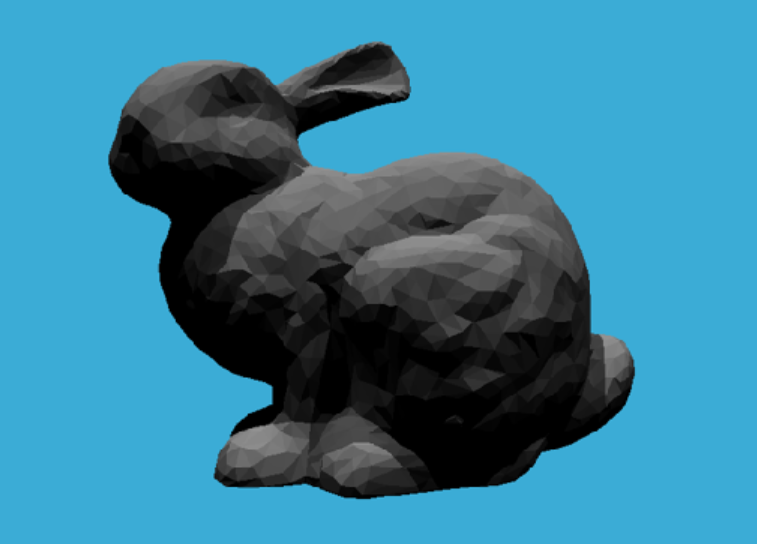

##### 作业6：加速结构

###### 1、实现包围盒求交

Bounds3.hpp: IntersectP函数

包围盒求交计算原理：取包围盒六个面计算进入-退出时间

$$t_{min}=max(t_{xmin},t_{ymin},t_{zmin})$$

$$t_{max}=min(t_{xmax},t_{ymax},t_{zmax})$$

代码实现：

```
float txmin = (this->pMin.x - ray.origin.x) * invDir[0], txmax = (this->pMax.x - ray.origin.x) * invDir[0];
float tymin = (this->pMin.y - ray.origin.y) * invDir[1], tymax = (this->pMax.y - ray.origin.y) * invDir[1];
float tzmin = (this->pMin.z - ray.origin.z) * invDir[2], tzmax = (this->pMax.z - ray.origin.z) * invDir[2];
if (!dirIsNeg[0]) { auto t = txmax; txmax = txmin; txmin = t; }
if (!dirIsNeg[1]) { auto t = tymax; tymax = tymin; tymin = t; }
if (!dirIsNeg[2]) { auto t = tzmax; tzmax = tzmin; tzmin = t; }
float tmin = std::max(txmin, std::max(tymin, tzmin)), tmax = std::min(txmax, std::min(tymax, tzmax));
if (tmin < tmax && tmax >= 0)return true;
else return false;
```

###### 2、实现BVH查找

BVH.cpp: getIntersection函数

思路：

- 光线与该包围盒是否相交 不相交则返回空
- 该包围盒节点是否为子节点，若为子节点则返回光线和该子节点包围盒中物体的相交情况
- 若该包围盒为父节点，递归查找该包围盒子节点，返回查找结果较近的相交结果

```
Vector3f invDir = { 1.0f / ray.direction.x,1.0f / ray.direction.y, 1.0f / ray.direction.z };
std::array<int, 3> dirIsNeg = 
	{ int(ray.direction.x > 0),int(ray.direction.y > 0), int(ray.direction.z > 0) };
if (node->bounds.IntersectP(ray, invDir, dirIsNeg) == false) 
	return Intersection();
if (node->left == nullptr && node->right == nullptr) 
	return node->object->getIntersection(ray);
Intersection l = getIntersection(node->left, ray);
Intersection r = getIntersection(node->right, ray);

Intersection result = l.distance < r.distance ? l : r;
return result;
```

###### 3、SAH查找

虽然说是理论能优化 但是实际上也就7s->6s 啊 看看就好

思路：按照位置划分包围盒

节点所包围的空间沿着跨度最长的那个坐标轴的方向将空间均等的划分为若干个桶（Buckets），划分只会出现在桶与桶之间的位置上。若桶的个数为 n 则只会有 n-1 种划分的可能。

```
int split_num = 12;//测了好几个好像都是6s 感觉一般
for (int i = 1; i < split_num; i++) {
    Bounds3 leftBounds, rightBounds;
    int num = -1;
    split_pos = 
    	(1.f - (float)i / split_num) * centroidBounds.pMin[dim] + 
    	((float)i / split_num) * centroidBounds.pMax[dim];
    //根据i的大小等距分割包围盒
    for (int k = 0; k < objects.size(); k++) {
        if(objects[k]->getBounds().Centroid()[dim]<split_pos)
        	leftBounds = Union(leftBounds, objects[k]->getBounds().Centroid());
        else {
            if (num == -1)num = k;
            rightBounds = Union(rightBounds, objects[k]->getBounds().Centroid());
        }
	}
	//包围盒划分object
    float cost = num * leftBounds.SurfaceArea() + (objects.size() - num) * rightBounds.SurfaceArea();
    //根据分割的包围盒中物体的个数和包围盒的表面积来计算权重，根据最小权重来区分包围盒
    //理论上在权重计算这一块有个公式 但是权重本质是比较大小 被我简化成这样了（
    //根据CSDN https://blog.csdn.net/Q_pril/article/details/124054123 这个权重理论上这么算
    //     time = S_1面积 /S_0面积 *S_1空间物体数 * t_obj    
    //              + S_2面积 /S_0面积 *S_2空间物体数 * t_obj 
    min_cost = min_cost < cost ? min_cost : cost;
    split_index = min_cost < cost ? split_index : num;
}

auto beginning = objects.begin();
auto middling = objects.begin() + split_index;
auto ending = objects.end();

auto leftshapes = std::vector<Object*>(beginning, middling);
auto rightshapes = std::vector<Object*>(middling, ending);
```

效果图如下

