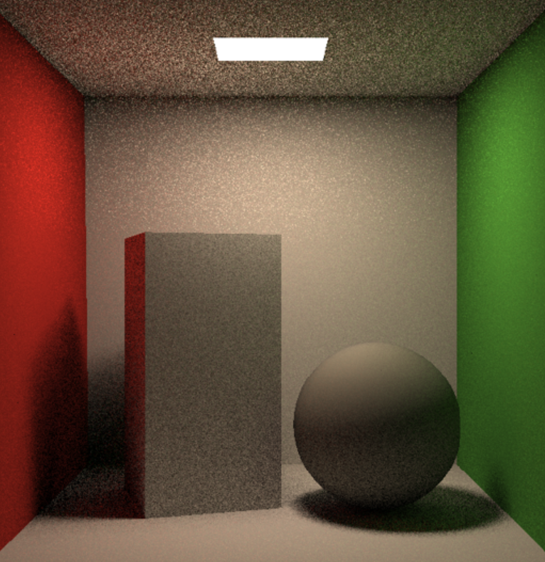

#### 作业7-最重量级

实现函数：

castRay() in Scene.cpp 根据工具函数搓出光线追踪

光追基本思想：

考虑光线碰撞的对象是光源还是物体，根据公式计算光照结果，其中对于物体需要递归下一步光照

理想情况：对于每个像素，光线追踪随机采样若干条光线，得到最后采样结果。

问题1：对于递归函数，对于光线的采样数量会指数级增长

解决方法：随机选取一条光线进行采样，避免指数爆炸

问题2：对于光线追踪的递归，需要考虑停止条件

解决方法：

1. 设定追踪上限，一般需要根据场景光照需求变化.  

2. RussianRoulette，直接开roll决定要不要继续

问题3：随机采样，导致光照强的位置采样数不够，图片中噪点多

解决方法（只球形光源有效）：对于球形光源，从光源采样一条光线，然后计算该物体与光源间光线是否受到遮挡，若不受遮挡则计算光线碰撞光源情况

伪代码思路：

```
光线追踪
if(不碰撞)return 0
if(碰撞发光物体)return light
auto L_dir, L_indir//直接光照 间接光照
sampleLight()//从光源采样光线
if(物体到光源未被遮挡)
	L_dir = ...
if(roll > p)//roll概率来考虑是否计算简介光照
	sampleLight()//从物体采样光线
	if(ray.intersection && intersection.nolight)//光线有碰撞且碰撞物体非光源
		L_indir = ...
return L_dir+L_indir
```

全代码有点长，就不放了

problems：

- 如果出现 http://games-cn.org/forums/topic/zuoyeqiguangxianxiangjiaoceshiyichang/ 所描述的部分平面相交被判定为 MISS 的问题，请注意判定 Bounding Box 与 Ray 相交时的边界是 t_enter <= t_exit，而不是 t_enter < t_exit. 此外，你还需要注意此判断的精度问题。

- 如果出现 http://games-cn.org/forums/topic/zuoyeqixuanrandejieguotaian/ 所描述的渲染结果较暗，出现横向黑色条纹的情况，很可能是因为直接光部分由于精度问题，被错误判断为遮挡，请试着通过精度调整放宽相交限制。

- 注意本框架中直接光部分 Intersection.emit 是采样得到的光源的 emission(Li)，Vector3f.norm() 返回的是向量的长度而非长度平方

- global.hpp下的get_random_float()随机数生成函数存在问题。
  会导致在重复调用该函数时，返回同一个值。

  解决方案是把其中定义的dev，rng，dist定义为static,改了之后出图速度嘎嘎快

效果图

左边是默认 右边球是Microfacet 参数16 拉的越高噪点越少 当然渲染时间upup



加分项多线程：

对于每个像素的渲染，单线程为每行每列遍历渲染，多线程可考虑多行同时渲染

加分项Microfacet：

这byd原理根本看不懂的 公式怎么给怎么写